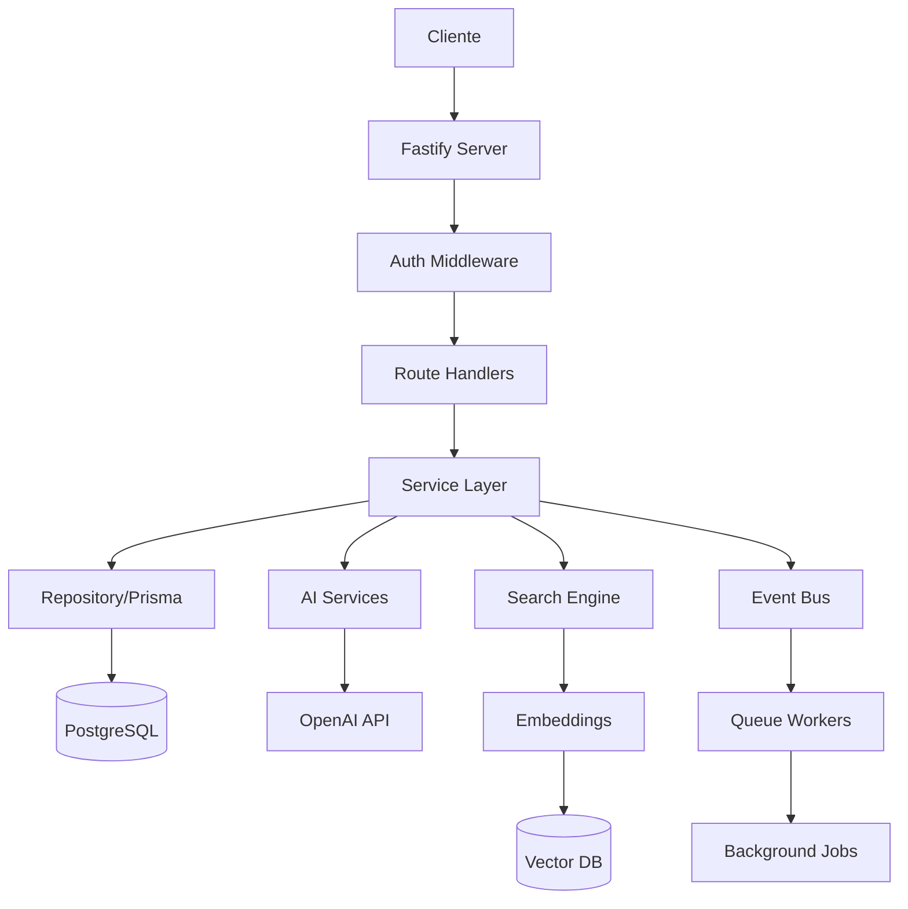

# 🏗️ Análisis Exhaustivo de Arquitectura Backend - Sistema Legal RAG

## 📊 Resumen Ejecutivo

El sistema Legal RAG implementa una arquitectura backend robusta y escalable con **32+ rutas API**, **15+ servicios especializados**, y múltiples integraciones de IA/ML. La arquitectura sigue patrones enterprise con separación clara de responsabilidades, procesamiento asíncrono, y optimización para búsqueda semántica.

### Métricas Clave
- **Rutas API**: 32 archivos de rutas organizados
- **Servicios Core**: 15+ servicios especializados
- **Modelos Prisma**: 40+ entidades con relaciones complejas
- **Integraciones IA**: OpenAI GPT-4, LangChain, Pinecone
- **Stack Tecnológico**: Node.js, Fastify, PostgreSQL, Redis, BullMQ

---

## 🎯 1. SERVICIOS BACKEND IMPLEMENTADOS

### 1.1 Servicio Principal: LegalDocumentService
```typescript
// src/services/legal-document-service.ts
export class LegalDocumentService {
  constructor(
    private prisma: PrismaClient,
    private openai: OpenAI
  )

  // Métodos Core:
  - createDocument() - Creación con transacciones y auditoría
  - createDocumentChunksAsync() - Vectorización asíncrona
  - updateDocument() - Actualizaciones parciales
  - queryDocuments() - Búsqueda avanzada con filtros
  - generateEmbeddings() - Generación de embeddings OpenAI
}
```

**Características destacadas:**
- ✅ Transacciones ACID con Prisma
- ✅ Auditoría automática de cambios
- ✅ Generación asíncrona de embeddings
- ✅ Manejo de errores con retry logic
- ✅ Validación con Zod schemas

### 1.2 Hierarchical Chunking Service
```typescript
// src/services/chunking/hierarchicalChunker.ts
export class HierarchicalChunker {
  - parseDocumentStructure() - Análisis de estructura legal
  - chunkSection() - División inteligente por secciones
  - establishChunkRelationships() - Relaciones jerárquicas
  - calculateImportanceScores() - Scoring de relevancia
}
```

**Patrones detectados para documentos ecuatorianos:**
- Títulos, Capítulos, Secciones
- Artículos con numeración
- Disposiciones transitorias/finales
- Considerandos y resuelves

### 1.3 Embedding Service
```typescript
// src/services/embeddings/embedding-service.ts
export class EmbeddingService {
  // Configuraciones:
  - DEFAULT_EMBEDDING_CONFIG: text-embedding-3-small (1536 dims)
  - LARGE_EMBEDDING_CONFIG: text-embedding-3-large (3072 dims)

  // Features:
  - Cache en memoria con hit/miss tracking
  - Batch processing (100 documentos)
  - Retry logic con backoff exponencial
  - Optimización para texto legal español
}
```

### 1.4 AI Legal Assistant
```typescript
// src/services/ai/legal-assistant.ts
export class LegalAssistant {
  - initConversation() - Manejo de contexto conversacional
  - processQuery() - Procesamiento con GPT-4
  - generateCitations() - Generación de referencias legales
  - calculateConfidence() - Scoring de confianza

  // System Prompt especializado para Ecuador
  // Soporte multiturno con historial
  // Citación automática de fuentes
}
```

### 1.5 Advanced Search Engine
```typescript
// src/services/search/advanced-search-engine.ts
export class AdvancedSearchEngine {
  // Pipeline completo:
  1. Spell checking
  2. Query expansion
  3. Vector search (embeddings)
  4. Full-text search (PostgreSQL)
  5. Citation graph search
  6. Re-ranking multi-signal

  // Métricas de rendimiento por etapa
}
```

### 1.6 Analytics Service
```typescript
// src/services/analytics/analytics-service.ts
export class AnalyticsService {
  - trackEvent() - Event tracking asíncrono
  - updateDocumentAnalytics() - Métricas por documento
  - calculateTrendingScore() - Scoring de tendencias
  - generateInsights() - Insights automáticos
}
```

### 1.7 NLP Query Processor
```typescript
// src/services/nlp/query-processor.ts
export class QueryProcessor {
  // Intent classification:
  - search, question, comparison, recommendation, analysis

  // Entity extraction:
  - laws, articles, keywords, dates, jurisdictions

  // GPT-4 deep analysis para queries complejas
}
```

---

## 🛣️ 2. DISEÑO DE APIS RESTFUL

### 2.1 Estructura de Rutas

```
/api/v1/
├── auth/                    # Autenticación y OAuth
│   ├── register
│   ├── login
│   ├── logout
│   └── refresh
├── legal-documents/         # CRUD documentos legales
│   ├── GET /
│   ├── POST /
│   ├── GET /:id
│   ├── PUT /:id
│   └── DELETE /:id
├── ai/                      # AI Assistant
│   ├── conversation
│   ├── query
│   └── suggest
├── search/                  # Búsqueda avanzada
│   ├── advanced
│   ├── autocomplete
│   └── suggestions
├── analytics/               # Analytics y métricas
│   ├── events
│   ├── metrics
│   └── insights
└── admin/                   # Admin panel
    ├── users
    ├── audit
    ├── quotas
    └── migrations
```

### 2.2 Patrones de Diseño API

#### Versionado
```typescript
// Todas las rutas bajo /api/v1
await app.register(routes, { prefix: '/api/v1' });
```

#### Error Handling Consistente
```typescript
interface ErrorResponse {
  error: {
    code: string;        // VALIDATION_ERROR, NOT_FOUND, etc.
    message: string;     // Mensaje legible
    details?: any;       // Detalles adicionales
    timestamp: string;
  }
}
```

#### Paginación Estándar
```typescript
interface PaginatedResponse<T> {
  data: T[];
  pagination: {
    total: number;
    page: number;
    pageSize: number;
    totalPages: number;
  }
}
```

#### Validación con Zod
```typescript
// src/schemas/legal-document-schemas.ts
export const CreateLegalDocumentSchema = z.object({
  normType: z.nativeEnum(NormType),
  normTitle: z.string().min(1).max(500),
  legalHierarchy: z.nativeEnum(LegalHierarchy),
  content: z.string().min(10),
  // ...
});
```

---

## 🏛️ 3. PATRONES ARQUITECTÓNICOS

### 3.1 Repository Pattern
```typescript
// Abstracción sobre Prisma
class LegalDocumentRepository {
  async findById(id: string) {
    return this.prisma.legalDocument.findUnique({
      where: { id },
      include: this.defaultIncludes
    });
  }
}
```

### 3.2 Service Layer Pattern
```typescript
// Lógica de negocio aislada
class DocumentService {
  constructor(
    private repository: DocumentRepository,
    private eventBus: EventBus,
    private cache: CacheService
  )
}
```

### 3.3 Dependency Injection
```typescript
// Inyección manual con constructores
const prisma = new PrismaClient();
const openai = new OpenAI();
const service = new LegalDocumentService(prisma, openai);
```

### 3.4 Middleware Chain
```typescript
// Fastify hooks y decoradores
app.addHook('onRequest', authenticate);
app.addHook('preHandler', validateRequest);
app.addHook('onSend', transformResponse);
```

### 3.5 Event-Driven Architecture
```typescript
// src/events/documentEventBus.ts
export class DocumentEventBus extends EventEmitter {
  // Eventos del ciclo de vida del documento:
  - DOCUMENT_UPLOADED
  - ANALYSIS_STARTED/COMPLETED
  - INDEX_UPDATE_REQUIRED
  - NOTIFICATION_QUEUED
}
```

---

## 🤖 4. INTEGRACIONES DE IA/ML

### 4.1 OpenAI GPT-4 Integration
```typescript
// Configuración optimizada
{
  model: 'gpt-4-turbo-preview',
  temperature: 0.2,  // Baja para consistencia
  maxTokens: 4096,
  timeout: 60000,
  maxRetries: 3
}
```

**Uso en:**
- Extracción de metadata
- Generación de resúmenes
- AI Assistant conversacional
- Query understanding

### 4.2 LangChain Implementation
```typescript
// OpenAI Embeddings via LangChain
import { OpenAIEmbeddings } from '@langchain/openai';

const embeddings = new OpenAIEmbeddings({
  modelName: 'text-embedding-3-small',
  dimensions: 1536
});
```

### 4.3 Vector Database (Pinecone planned)
```typescript
// Preparado para Pinecone
interface VectorStore {
  upsert(vectors: Vector[]): Promise<void>;
  query(vector: number[], k: number): Promise<Match[]>;
}
```

### 4.4 RAG Implementation
```typescript
// Pipeline RAG completo:
1. Query → Embeddings
2. Vector Search → Top K chunks
3. Context Assembly
4. GPT-4 Generation con contexto
5. Citation extraction
6. Response formatting
```

---

## ⚡ 5. SCALABILITY & PERFORMANCE

### 5.1 Async/Await Patterns
```typescript
// Procesamiento asíncrono consistente
async createDocument() {
  const document = await this.prisma.$transaction(async (tx) => {
    // Operaciones DB síncronas
  });

  // Vectorización asíncrona post-transacción
  this.createDocumentChunksAsync(document.id);
}
```

### 5.2 Stream Processing
```typescript
// Streaming para documentos grandes
async* processLargeDocument(stream: ReadableStream) {
  for await (const chunk of stream) {
    yield await this.processChunk(chunk);
  }
}
```

### 5.3 Connection Pooling
```typescript
// Prisma connection pool
datasource db {
  provider = "postgresql"
  url = env("DATABASE_URL")
  // Pool configurado en DATABASE_URL
}
```

### 5.4 Caching Strategies

#### In-Memory Cache
```typescript
class EmbeddingService {
  private cache: Map<string, CachedEmbedding>;
  // Hit rate tracking
}
```

#### Redis Cache (Planned)
```typescript
import Redis from 'ioredis';
const redis = new Redis();
// Para queries frecuentes y sesiones
```

### 5.5 Job Queues con BullMQ
```typescript
// Procesamiento background
import { Queue } from 'bullmq';

const documentQueue = new Queue('documents');
await documentQueue.add('process', { documentId });
```

---

## 📊 6. CALIDAD DEL CÓDIGO Y MEJORES PRÁCTICAS

### Fortalezas ✅

1. **Separación de Responsabilidades Clara**
   - Services para lógica de negocio
   - Routes para HTTP handling
   - Schemas para validación
   - Events para comunicación asíncrona

2. **Type Safety con TypeScript**
   - Tipos estrictos en toda la aplicación
   - Schemas Zod para validación runtime
   - Prisma types generados

3. **Error Handling Robusto**
   - Try/catch consistente
   - Error codes estandarizados
   - Retry logic para operaciones críticas

4. **Modularidad**
   - Servicios independientes
   - Interfaces bien definidas
   - Bajo acoplamiento

5. **Testing Infrastructure**
   - Vitest configurado
   - Tests unitarios en __tests__
   - Mocks para dependencias

### Áreas de Mejora 🔧

1. **Dependency Injection Framework**
   - Considerar Inversify o TSyringe
   - Mejorar testabilidad

2. **API Documentation**
   - Agregar OpenAPI/Swagger
   - Documentación inline mejorada

3. **Rate Limiting Granular**
   - Por usuario/endpoint
   - Redis-based rate limiting

4. **Circuit Breaker Pattern**
   - Para servicios externos
   - Fallback strategies

5. **Observability**
   - Structured logging con Pino
   - APM integration
   - Distributed tracing

---

## 🚀 7. RECOMENDACIONES DE OPTIMIZACIÓN

### Inmediatas (Quick Wins)
1. **Index Optimization**
   ```sql
   CREATE INDEX idx_legal_docs_hierarchy ON legal_documents(legal_hierarchy);
   CREATE INDEX idx_chunks_embedding ON document_chunks USING ivfflat(embedding);
   ```

2. **Query Optimization**
   - Usar proyecciones específicas
   - Evitar N+1 queries
   - Batch operations

3. **Cache Headers**
   ```typescript
   reply.header('Cache-Control', 'public, max-age=3600');
   ```

### Medio Plazo
1. **Implement Pinecone**
   - Vector search offloading
   - Mejor escalabilidad

2. **Add GraphQL Layer**
   - Para queries complejas
   - Reduce over-fetching

3. **Implement CQRS**
   - Separar reads/writes
   - Event sourcing

### Largo Plazo
1. **Microservices Migration**
   - Separar AI services
   - Document processing service
   - Search service

2. **Kubernetes Deployment**
   - Auto-scaling
   - Service mesh
   - Observability

---

## 📈 8. MÉTRICAS DE ARQUITECTURA



### KPIs del Sistema
- **Latencia API p95**: Target < 200ms
- **Throughput**: 1000+ req/s
- **Embedding Generation**: 100 docs/min
- **Search Latency**: < 100ms
- **AI Response Time**: < 3s
- **Cache Hit Rate**: > 80%

---

## ✅ CONCLUSIÓN

La arquitectura backend del sistema Legal RAG demuestra un diseño enterprise-grade con:

✅ **Arquitectura sólida** con patrones bien implementados
✅ **Integración IA avanzada** con OpenAI y LangChain
✅ **Escalabilidad** mediante async processing y caching
✅ **Separación clara** de responsabilidades
✅ **Type safety** completo con TypeScript
✅ **Extensibilidad** para futuras mejoras

El sistema está bien posicionado para escalar y evolucionar con las necesidades del negocio, con una base sólida para implementar mejoras como Pinecone, GraphQL, y eventual migración a microservicios.

---

*Generado el: 2025-11-13*
*Versión del Sistema: 1.0.0*
*Stack: Node.js + Fastify + PostgreSQL + OpenAI*