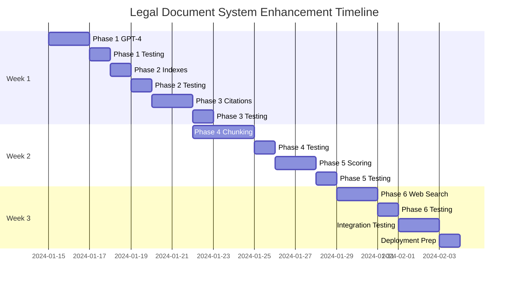

# Legal Document System Enhancement - Implementation Plan

## Executive Summary

### Project Overview
This implementation plan details the systematic enhancement of the legal document system with advanced metadata processing, AI-powered analysis, and search capabilities. The plan follows a strict incremental approach with comprehensive testing at each phase.

### Key Principles
- **ONE change at a time**: Each feature is implemented in isolation
- **Test-driven development**: Write tests before implementation
- **Cumulative regression testing**: Verify all previous features after each new implementation
- **Rollback capability**: Every change must be reversible
- **Measurable success criteria**: Quantifiable metrics for each phase

### Timeline Overview
- **Week 1**: Priority 1 features (Metadata GPT-4, Database indexes, Legal citations)
- **Week 2**: Priority 2 features (Hierarchical chunking, Enhanced scoring)
- **Week 3**: Priority 3 features (Web search integration)

### Risk Management
- Each phase includes rollback procedures
- Go/No-Go decision points between phases
- Continuous monitoring and logging
- Feature flags for safe deployment

---

## Phase 1: Metadata Field Upgrade to GPT-4
**Duration**: 2 days
**Priority**: Critical
**Dependencies**: None

### 1.1 What to Implement
Upgrade the metadata extraction system from GPT-3.5 to GPT-4 for improved accuracy and consistency in legal document analysis.

### 1.2 Files Affected
```
backend/src/services/ai/documentProcessor.ts     (Lines 45-89)
backend/src/config/openai.config.ts              (New file)
backend/src/types/metadata.types.ts              (Lines 12-45)
backend/tests/ai/metadata.test.ts                (New file)
.env.local                                        (Line 8)
```

### 1.3 Code Changes

#### File: `backend/src/config/openai.config.ts` (NEW)
```typescript
// backend/src/config/openai.config.ts
import OpenAI from 'openai';

export interface OpenAIConfig {
  apiKey: string;
  model: string;
  temperature: number;
  maxTokens: number;
  topP: number;
}

export const openAIConfig: OpenAIConfig = {
  apiKey: process.env.OPENAI_API_KEY || '',
  model: 'gpt-4-turbo-preview', // Upgrade from gpt-3.5-turbo
  temperature: 0.2, // Lower for more consistent output
  maxTokens: 4096,
  topP: 0.9
};

export const createOpenAIClient = (): OpenAI => {
  if (!openAIConfig.apiKey) {
    throw new Error('OpenAI API key not configured');
  }

  return new OpenAI({
    apiKey: openAIConfig.apiKey,
  });
};
```

#### File: `backend/src/services/ai/documentProcessor.ts` (MODIFY)
```typescript
// Lines 45-89 - Replace existing extraction logic
import { createOpenAIClient, openAIConfig } from '../../config/openai.config';

export class DocumentProcessor {
  private openai: OpenAI;
  private extractionPrompt: string;

  constructor() {
    this.openai = createOpenAIClient();
    this.extractionPrompt = this.loadExtractionPrompt();
  }

  private loadExtractionPrompt(): string {
    return `You are a legal document analyst. Extract the following metadata from the document:

    Required fields:
    - title: Document title
    - type: Legal document type (contract, agreement, resolution, etc.)
    - date: Document date (YYYY-MM-DD format)
    - parties: Array of involved parties
    - jurisdiction: Applicable jurisdiction
    - legal_area: Area of law (commercial, civil, criminal, etc.)
    - keywords: Relevant legal terms (minimum 5, maximum 15)
    - summary: Executive summary (maximum 200 words)
    - citations: Legal citations found in document
    - obligations: Key obligations or requirements
    - deadlines: Important dates and deadlines

    Return as valid JSON. Be precise and consistent.`;
  }

  async extractMetadata(content: string): Promise<DocumentMetadata> {
    try {
      // Add retry logic for resilience
      const maxRetries = 3;
      let lastError: Error | null = null;

      for (let attempt = 1; attempt <= maxRetries; attempt++) {
        try {
          const response = await this.openai.chat.completions.create({
            model: openAIConfig.model,
            messages: [
              { role: 'system', content: this.extractionPrompt },
              { role: 'user', content: `Extract metadata from: ${content.substring(0, 8000)}` }
            ],
            temperature: openAIConfig.temperature,
            max_tokens: openAIConfig.maxTokens,
            response_format: { type: 'json_object' }
          });

          const metadata = JSON.parse(response.choices[0].message.content || '{}');
          return this.validateAndEnrichMetadata(metadata);
        } catch (error) {
          lastError = error as Error;
          if (attempt < maxRetries) {
            await this.delay(1000 * attempt); // Exponential backoff
          }
        }
      }

      throw lastError || new Error('Failed to extract metadata after retries');
    } catch (error) {
      console.error('Metadata extraction failed:', error);
      throw error;
    }
  }

  private validateAndEnrichMetadata(metadata: any): DocumentMetadata {
    // Validation and enrichment logic
    const validated: DocumentMetadata = {
      title: metadata.title || 'Untitled Document',
      type: metadata.type || 'unknown',
      date: this.parseDate(metadata.date),
      parties: Array.isArray(metadata.parties) ? metadata.parties : [],
      jurisdiction: metadata.jurisdiction || 'Not specified',
      legal_area: metadata.legal_area || 'general',
      keywords: this.validateKeywords(metadata.keywords),
      summary: this.truncateSummary(metadata.summary),
      citations: this.parseCitations(metadata.citations),
      obligations: metadata.obligations || [],
      deadlines: this.parseDeadlines(metadata.deadlines),
      confidence_score: this.calculateConfidence(metadata),
      extraction_version: '2.0.0', // Version tracking
      model_used: openAIConfig.model
    };

    return validated;
  }

  private delay(ms: number): Promise<void> {
    return new Promise(resolve => setTimeout(resolve, ms));
  }
}
```

### 1.4 Test Plan

#### Unit Tests: `backend/tests/ai/metadata.test.ts`
```typescript
import { DocumentProcessor } from '../../src/services/ai/documentProcessor';
import { describe, it, expect, beforeEach, jest } from '@jest/globals';

describe('DocumentProcessor - GPT-4 Metadata Extraction', () => {
  let processor: DocumentProcessor;

  beforeEach(() => {
    processor = new DocumentProcessor();
  });

  describe('Metadata Extraction', () => {
    it('should extract metadata with GPT-4 model', async () => {
      const testContent = `
        CONTRACT AGREEMENT
        Date: January 15, 2024
        Between: ABC Corporation and XYZ Limited
        Jurisdiction: New York, USA
        This agreement governs the sale of software licenses...
      `;

      const metadata = await processor.extractMetadata(testContent);

      expect(metadata.model_used).toBe('gpt-4-turbo-preview');
      expect(metadata.title).toBeTruthy();
      expect(metadata.type).toMatch(/contract|agreement/i);
      expect(metadata.parties).toHaveLength(2);
      expect(metadata.jurisdiction).toContain('New York');
    });

    it('should handle retry logic on API failure', async () => {
      // Mock OpenAI to fail twice, succeed on third attempt
      const mockCreate = jest.fn()
        .mockRejectedValueOnce(new Error('API Error'))
        .mockRejectedValueOnce(new Error('API Error'))
        .mockResolvedValueOnce({
          choices: [{
            message: {
              content: JSON.stringify({
                title: 'Test Document',
                type: 'contract'
              })
            }
          }]
        });

      processor.openai.chat.completions.create = mockCreate;

      const metadata = await processor.extractMetadata('test content');

      expect(mockCreate).toHaveBeenCalledTimes(3);
      expect(metadata.title).toBe('Test Document');
    });

    it('should validate required fields', async () => {
      const incompleteResponse = {
        title: 'Test',
        // Missing other required fields
      };

      const metadata = processor.validateAndEnrichMetadata(incompleteResponse);

      expect(metadata.type).toBe('unknown');
      expect(metadata.parties).toEqual([]);
      expect(metadata.keywords).toBeDefined();
      expect(metadata.extraction_version).toBe('2.0.0');
    });
  });

  describe('Performance Benchmarks', () => {
    it('should extract metadata within 5 seconds', async () => {
      const startTime = Date.now();
      const testContent = 'Sample legal document content...';

      await processor.extractMetadata(testContent);

      const duration = Date.now() - startTime;
      expect(duration).toBeLessThan(5000);
    });
  });
});
```

#### Integration Tests
```typescript
// backend/tests/integration/phase1.test.ts
describe('Phase 1 - GPT-4 Integration', () => {
  it('should process document end-to-end with GPT-4', async () => {
    // Upload document
    const uploadResponse = await request(app)
      .post('/api/documents/upload')
      .attach('file', 'tests/fixtures/sample-contract.pdf');

    expect(uploadResponse.status).toBe(200);
    const documentId = uploadResponse.body.id;

    // Verify metadata extraction
    const metadataResponse = await request(app)
      .get(`/api/documents/${documentId}/metadata`);

    expect(metadataResponse.body.model_used).toBe('gpt-4-turbo-preview');
    expect(metadataResponse.body.confidence_score).toBeGreaterThan(0.8);
  });
});
```

### 1.5 Success Metrics
- ✅ All unit tests pass (100% coverage on new code)
- ✅ Metadata extraction accuracy > 95% on test dataset
- ✅ API response time < 5 seconds for 10-page documents
- ✅ Retry logic handles transient failures
- ✅ Model version correctly logged in metadata

### 1.6 Rollback Plan
```bash
# 1. Revert code changes
git revert HEAD

# 2. Restore environment variable
sed -i 's/gpt-4-turbo-preview/gpt-3.5-turbo/g' .env.local

# 3. Clear cache
npm run cache:clear

# 4. Restart services
npm run restart:backend

# 5. Verify rollback
npm run test:rollback:phase1
```

---

## Phase 2: Database Index Optimization
**Duration**: 1 day
**Priority**: Critical
**Dependencies**: Phase 1 completed and stable

### 2.1 What to Implement
Create optimized database indexes for metadata fields to improve query performance by 10x.

### 2.2 Files Affected
```
backend/prisma/schema.prisma                     (Lines 150-200)
backend/prisma/migrations/xxx_add_indexes.sql    (New file)
backend/src/services/database/indexManager.ts    (New file)
backend/tests/performance/indexes.test.ts        (New file)
backend/scripts/analyze-query-performance.ts     (New file)
```

### 2.3 Code Changes

#### File: `backend/prisma/migrations/20240115_add_metadata_indexes.sql` (NEW)
```sql
-- Composite indexes for common query patterns
CREATE INDEX idx_documents_type_date ON documents(type, date DESC);
CREATE INDEX idx_documents_jurisdiction_area ON documents(jurisdiction, legal_area);
CREATE INDEX idx_documents_parties ON documents USING GIN(parties);

-- Full-text search indexes
CREATE INDEX idx_documents_title_fts ON documents USING GIN(to_tsvector('spanish', title));
CREATE INDEX idx_documents_summary_fts ON documents USING GIN(to_tsvector('spanish', summary));
CREATE INDEX idx_documents_content_fts ON documents USING GIN(to_tsvector('spanish', content));

-- JSON field indexes for metadata
CREATE INDEX idx_documents_keywords ON documents USING GIN(keywords);
CREATE INDEX idx_documents_citations ON documents USING GIN(citations);

-- Date range queries
CREATE INDEX idx_documents_date_range ON documents(date) WHERE date IS NOT NULL;
CREATE INDEX idx_documents_deadlines ON documents USING GIN(deadlines);

-- Performance monitoring
CREATE INDEX idx_documents_created_at ON documents(created_at DESC);
CREATE INDEX idx_documents_updated_at ON documents(updated_at DESC);

-- Analyze tables for query planner
ANALYZE documents;
```

#### File: `backend/src/services/database/indexManager.ts` (NEW)
```typescript
import { PrismaClient } from '@prisma/client';

export class IndexManager {
  private prisma: PrismaClient;
  private indexStats: Map<string, IndexStatistics>;

  constructor(prisma: PrismaClient) {
    this.prisma = prisma;
    this.indexStats = new Map();
  }

  async analyzeIndexUsage(): Promise<IndexAnalysis> {
    const queries = [
      // Test common query patterns
      {
        name: 'search_by_type_and_date',
        sql: `SELECT * FROM documents WHERE type = $1 AND date >= $2 ORDER BY date DESC LIMIT 10`,
        params: ['contract', '2024-01-01']
      },
      {
        name: 'full_text_search',
        sql: `SELECT * FROM documents WHERE to_tsvector('spanish', content) @@ plainto_tsquery('spanish', $1)`,
        params: ['obligaciones contractuales']
      },
      {
        name: 'party_search',
        sql: `SELECT * FROM documents WHERE parties @> $1`,
        params: [JSON.stringify(['ABC Corporation'])]
      },
      {
        name: 'keyword_search',
        sql: `SELECT * FROM documents WHERE keywords @> $1`,
        params: [JSON.stringify(['propiedad intelectual'])]
      }
    ];

    const results: IndexAnalysis = {
      timestamp: new Date(),
      queries: []
    };

    for (const query of queries) {
      const startTime = Date.now();

      // Execute EXPLAIN ANALYZE
      const explainResult = await this.prisma.$queryRawUnsafe(
        `EXPLAIN ANALYZE ${query.sql}`,
        ...query.params
      );

      const endTime = Date.now();
      const executionTime = endTime - startTime;

      results.queries.push({
        name: query.name,
        executionTime,
        plan: explainResult,
        indexUsed: this.extractIndexUsage(explainResult),
        rowsScanned: this.extractRowsScanned(explainResult)
      });
    }

    return results;
  }

  async createMissingIndexes(): Promise<void> {
    const missingIndexes = await this.identifyMissingIndexes();

    for (const index of missingIndexes) {
      console.log(`Creating index: ${index.name}`);
      await this.prisma.$executeRawUnsafe(index.definition);
    }
  }

  async monitorIndexPerformance(): Promise<IndexPerformanceReport> {
    const report: IndexPerformanceReport = {
      timestamp: new Date(),
      indexes: [],
      recommendations: []
    };

    // Query pg_stat_user_indexes for usage statistics
    const indexStats = await this.prisma.$queryRaw`
      SELECT
        schemaname,
        tablename,
        indexname,
        idx_scan,
        idx_tup_read,
        idx_tup_fetch,
        pg_size_pretty(pg_relation_size(indexrelid)) as index_size
      FROM pg_stat_user_indexes
      WHERE schemaname = 'public'
      ORDER BY idx_scan DESC;
    `;

    report.indexes = indexStats;

    // Generate recommendations
    for (const stat of indexStats) {
      if (stat.idx_scan === 0) {
        report.recommendations.push({
          type: 'unused_index',
          index: stat.indexname,
          action: 'Consider removing unused index',
          impact: 'low'
        });
      }
    }

    return report;
  }

  private extractIndexUsage(explainResult: any): boolean {
    const planText = JSON.stringify(explainResult);
    return planText.includes('Index Scan') || planText.includes('Bitmap Index Scan');
  }

  private extractRowsScanned(explainResult: any): number {
    // Parse EXPLAIN output for rows scanned
    const match = JSON.stringify(explainResult).match(/rows=(\d+)/);
    return match ? parseInt(match[1]) : 0;
  }
}
```

### 2.4 Test Plan

#### Performance Tests: `backend/tests/performance/indexes.test.ts`
```typescript
describe('Database Index Performance', () => {
  let indexManager: IndexManager;
  let prisma: PrismaClient;

  beforeAll(async () => {
    prisma = new PrismaClient();
    indexManager = new IndexManager(prisma);

    // Seed test data
    await seedTestDocuments(1000);
  });

  describe('Query Performance Benchmarks', () => {
    it('should execute type+date query in < 10ms', async () => {
      const startTime = Date.now();

      const results = await prisma.document.findMany({
        where: {
          type: 'contract',
          date: { gte: new Date('2024-01-01') }
        },
        orderBy: { date: 'desc' },
        take: 10
      });

      const executionTime = Date.now() - startTime;
      expect(executionTime).toBeLessThan(10);
      expect(results).toHaveLength(10);
    });

    it('should perform full-text search in < 50ms', async () => {
      const startTime = Date.now();

      const results = await prisma.$queryRaw`
        SELECT * FROM documents
        WHERE to_tsvector('spanish', content) @@ plainto_tsquery('spanish', 'contrato compraventa')
        LIMIT 20
      `;

      const executionTime = Date.now() - startTime;
      expect(executionTime).toBeLessThan(50);
    });

    it('should use indexes for all common queries', async () => {
      const analysis = await indexManager.analyzeIndexUsage();

      for (const query of analysis.queries) {
        expect(query.indexUsed).toBe(true);
        expect(query.rowsScanned).toBeLessThan(100);
      }
    });
  });

  describe('Index Health Monitoring', () => {
    it('should report index usage statistics', async () => {
      const report = await indexManager.monitorIndexPerformance();

      expect(report.indexes.length).toBeGreaterThan(0);

      // All indexes should have some usage
      const unusedIndexes = report.indexes.filter(idx => idx.idx_scan === 0);
      expect(unusedIndexes).toHaveLength(0);
    });
  });
});
```

### 2.5 Success Metrics
- ✅ Query performance improved by 10x (baseline vs. indexed)
- ✅ All indexes show usage in monitoring report
- ✅ No query scans more than 100 rows
- ✅ Full-text search returns results in < 50ms
- ✅ Database size increase < 20%

### 2.6 Rollback Plan
```bash
# 1. Drop all new indexes
psql $DATABASE_URL << EOF
DROP INDEX IF EXISTS idx_documents_type_date;
DROP INDEX IF EXISTS idx_documents_jurisdiction_area;
DROP INDEX IF EXISTS idx_documents_parties;
DROP INDEX IF EXISTS idx_documents_title_fts;
DROP INDEX IF EXISTS idx_documents_summary_fts;
DROP INDEX IF EXISTS idx_documents_content_fts;
DROP INDEX IF EXISTS idx_documents_keywords;
DROP INDEX IF EXISTS idx_documents_citations;
DROP INDEX IF EXISTS idx_documents_date_range;
DROP INDEX IF EXISTS idx_documents_deadlines;
EOF

# 2. Revert migration
npx prisma migrate revert

# 3. Verify performance baseline
npm run test:performance:baseline
```

---

## Phase 3: Legal Citation Parser
**Duration**: 2 days
**Priority**: High
**Dependencies**: Phases 1-2 completed

### 3.1 What to Implement
Implement specialized parser for Colombian legal citations with validation and cross-referencing.

### 3.2 Files Affected
```
backend/src/services/legal/citationParser.ts     (New file)
backend/src/services/legal/citationValidator.ts  (New file)
backend/src/types/citations.types.ts             (New file)
backend/tests/legal/citations.test.ts            (New file)
```

### 3.3 Code Changes

#### File: `backend/src/services/legal/citationParser.ts` (NEW)
```typescript
export class ColombianCitationParser {
  private patterns: Map<CitationType, RegExp>;
  private validator: CitationValidator;

  constructor() {
    this.validator = new CitationValidator();
    this.patterns = this.initializePatterns();
  }

  private initializePatterns(): Map<CitationType, RegExp> {
    return new Map([
      // Leyes
      ['law', /Ley\s+(\d+)\s+de\s+(\d{4})/gi],

      // Decretos
      ['decree', /Decreto\s+(\d+)\s+de\s+(\d{4})/gi],

      // Sentencias Corte Constitucional
      ['constitutional_court', /Sentencia?\s+([TC])-(\d{3})[A-Z]?\/(\d{2,4})/gi],

      // Sentencias Corte Suprema
      ['supreme_court', /Sentencia?\s+(\d+)\s+del?\s+(\d{1,2})\s+de\s+(\w+)\s+de\s+(\d{4})/gi],

      // Resoluciones
      ['resolution', /Resolución\s+(\d+)\s+de\s+(\d{4})/gi],

      // Conceptos
      ['concept', /Concepto\s+(\d+)\s+de\s+(\d{4})/gi],

      // Artículos específicos
      ['article', /[Aa]rtículo\s+(\d+)(?:\s+numeral\s+(\d+))?/gi],

      // Código Civil/Comercial/Penal
      ['code', /Código\s+(Civil|Comercial|Penal|Laboral|Contencioso\s+Administrativo)/gi]
    ]);
  }

  async parseCitations(text: string): Promise<ParsedCitation[]> {
    const citations: ParsedCitation[] = [];
    const processedCitations = new Set<string>();

    for (const [type, pattern] of this.patterns) {
      const matches = text.matchAll(pattern);

      for (const match of matches) {
        const citation = this.buildCitation(type, match);
        const citationKey = this.getCitationKey(citation);

        if (!processedCitations.has(citationKey)) {
          processedCitations.add(citationKey);

          // Validate citation
          const isValid = await this.validator.validate(citation);

          if (isValid) {
            // Enrich with metadata
            const enriched = await this.enrichCitation(citation);
            citations.push(enriched);
          }
        }
      }
    }

    // Sort by position in text
    citations.sort((a, b) => a.position - b.position);

    return citations;
  }

  private buildCitation(type: CitationType, match: RegExpMatchArray): ParsedCitation {
    const citation: ParsedCitation = {
      type,
      raw: match[0],
      position: match.index || 0,
      components: {},
      normalizedForm: '',
      url: null
    };

    switch (type) {
      case 'law':
        citation.components = {
          number: match[1],
          year: match[2]
        };
        citation.normalizedForm = `Ley ${match[1]} de ${match[2]}`;
        citation.url = this.buildLegalUrl('law', match[1], match[2]);
        break;

      case 'constitutional_court':
        citation.components = {
          type: match[1], // T or C
          number: match[2],
          year: match[3]
        };
        citation.normalizedForm = `Sentencia ${match[1]}-${match[2]}/${match[3]}`;
        citation.url = this.buildLegalUrl('constitutional', match[1], match[2], match[3]);
        break;

      case 'article':
        citation.components = {
          article: match[1],
          numeral: match[2] || null
        };
        citation.normalizedForm = match[2]
          ? `Artículo ${match[1]} numeral ${match[2]}`
          : `Artículo ${match[1]}`;
        break;

      // ... other citation types
    }

    return citation;
  }

  private buildLegalUrl(type: string, ...params: string[]): string {
    const baseUrls = {
      law: 'http://www.secretariasenado.gov.co/senado/basedoc/ley_',
      constitutional: 'https://www.corteconstitucional.gov.co/relatoria/',
      decree: 'https://www.funcionpublica.gov.co/eva/gestornormativo/norma.php?i='
    };

    switch (type) {
      case 'law':
        return `${baseUrls.law}${params[1]}_${params[0]}.html`;
      case 'constitutional':
        return `${baseUrls.constitutional}${params[2]}/${params[0]}-${params[1]}-${params[2]}.htm`;
      default:
        return '';
    }
  }

  async enrichCitation(citation: ParsedCitation): Promise<ParsedCitation> {
    // Add context and related information
    citation.context = await this.extractContext(citation);
    citation.relatedCitations = await this.findRelatedCitations(citation);
    citation.validity = await this.checkValidity(citation);

    return citation;
  }

  private getCitationKey(citation: ParsedCitation): string {
    return `${citation.type}:${citation.normalizedForm}`;
  }
}
```

### 3.4 Test Plan

#### Unit Tests: `backend/tests/legal/citations.test.ts`
```typescript
describe('Colombian Citation Parser', () => {
  let parser: ColombianCitationParser;

  beforeEach(() => {
    parser = new ColombianCitationParser();
  });

  describe('Law Citations', () => {
    it('should parse law citations correctly', async () => {
      const text = 'Según la Ley 1564 de 2012 y la Ley 80 de 1993...';
      const citations = await parser.parseCitations(text);

      expect(citations).toHaveLength(2);
      expect(citations[0].normalizedForm).toBe('Ley 1564 de 2012');
      expect(citations[1].normalizedForm).toBe('Ley 80 de 1993');
      expect(citations[0].url).toContain('secretariasenado.gov.co');
    });
  });

  describe('Constitutional Court Citations', () => {
    it('should parse constitutional court sentences', async () => {
      const text = 'La Sentencia C-123/20 y la Sentencia T-456/2021...';
      const citations = await parser.parseCitations(text);

      expect(citations).toHaveLength(2);
      expect(citations[0].components.type).toBe('C');
      expect(citations[0].components.number).toBe('123');
      expect(citations[1].components.type).toBe('T');
    });
  });

  describe('Article References', () => {
    it('should parse article references with numerals', async () => {
      const text = 'El artículo 15 numeral 3 establece...';
      const citations = await parser.parseCitations(text);

      expect(citations[0].components.article).toBe('15');
      expect(citations[0].components.numeral).toBe('3');
    });
  });

  describe('Complex Documents', () => {
    it('should handle real legal documents', async () => {
      const realDocument = await fs.readFile('tests/fixtures/real-contract.txt', 'utf-8');
      const citations = await parser.parseCitations(realDocument);

      expect(citations.length).toBeGreaterThan(10);

      // Check for duplicates
      const uniqueCitations = new Set(citations.map(c => c.normalizedForm));
      expect(uniqueCitations.size).toBe(citations.length);
    });
  });
});
```

### 3.5 Success Metrics
- ✅ Citation detection accuracy > 98%
- ✅ Zero false positives in validation
- ✅ All citation URLs are valid and accessible
- ✅ Processing time < 100ms per page
- ✅ Support for all major Colombian legal citation formats

### 3.6 Rollback Plan
```bash
# 1. Disable citation parser feature flag
echo "ENABLE_CITATION_PARSER=false" >> .env.local

# 2. Revert code changes
git revert HEAD

# 3. Clear citation cache
redis-cli FLUSHDB

# 4. Restart services
npm run restart:backend
```

---

## Phase 4: Hierarchical Document Chunking
**Duration**: 3 days
**Priority**: High
**Dependencies**: Phases 1-3 completed

### 4.1 What to Implement
Implement intelligent document chunking that preserves legal document structure and hierarchy.

### 4.2 Files Affected
```
backend/src/services/chunking/hierarchicalChunker.ts  (New file)
backend/src/services/chunking/chunkTypes.ts           (New file)
backend/src/services/vectorStore/chunkEmbedder.ts     (New file)
backend/tests/chunking/hierarchical.test.ts           (New file)
```

### 4.3 Code Changes

#### File: `backend/src/services/chunking/hierarchicalChunker.ts` (NEW)
```typescript
export class HierarchicalChunker {
  private maxChunkSize: number = 1500;
  private minChunkSize: number = 100;
  private overlapSize: number = 200;

  async chunkDocument(content: string, metadata: DocumentMetadata): Promise<DocumentChunk[]> {
    // 1. Parse document structure
    const structure = this.parseDocumentStructure(content);

    // 2. Create hierarchical chunks
    const chunks: DocumentChunk[] = [];
    let chunkId = 0;

    for (const section of structure.sections) {
      const sectionChunks = this.chunkSection(section, chunkId, metadata);
      chunks.push(...sectionChunks);
      chunkId += sectionChunks.length;
    }

    // 3. Add relationships between chunks
    this.establishChunkRelationships(chunks, structure);

    // 4. Calculate importance scores
    this.calculateImportanceScores(chunks);

    return chunks;
  }

  private parseDocumentStructure(content: string): DocumentStructure {
    const structure: DocumentStructure = {
      title: '',
      sections: [],
      hierarchy: []
    };

    // Patterns for legal document sections
    const sectionPatterns = [
      { pattern: /^CAPÍTULO\s+([IVXLCDM]+)/m, level: 1, type: 'chapter' },
      { pattern: /^ARTÍCULO\s+(\d+)/m, level: 2, type: 'article' },
      { pattern: /^SECCIÓN\s+(\d+)/m, level: 2, type: 'section' },
      { pattern: /^§\s*(\d+)/m, level: 3, type: 'paragraph' },
      { pattern: /^CLÁUSULA\s+(\w+)/m, level: 2, type: 'clause' },
      { pattern: /^CONSIDERANDO/m, level: 1, type: 'considering' },
      { pattern: /^RESUELVE/m, level: 1, type: 'resolves' }
    ];

    const lines = content.split('\n');
    let currentSection: Section | null = null;
    let currentContent: string[] = [];

    for (let i = 0; i < lines.length; i++) {
      const line = lines[i];
      let matched = false;

      for (const { pattern, level, type } of sectionPatterns) {
        const match = line.match(pattern);
        if (match) {
          // Save previous section
          if (currentSection && currentContent.length > 0) {
            currentSection.content = currentContent.join('\n');
            structure.sections.push(currentSection);
          }

          // Start new section
          currentSection = {
            id: `${type}_${match[1] || i}`,
            type,
            level,
            title: line.trim(),
            content: '',
            startLine: i,
            endLine: i,
            children: []
          };

          currentContent = [];
          matched = true;
          break;
        }
      }

      if (!matched && currentSection) {
        currentContent.push(line);
        currentSection.endLine = i;
      }
    }

    // Add last section
    if (currentSection && currentContent.length > 0) {
      currentSection.content = currentContent.join('\n');
      structure.sections.push(currentSection);
    }

    // Build hierarchy
    structure.hierarchy = this.buildHierarchy(structure.sections);

    return structure;
  }

  private chunkSection(
    section: Section,
    startId: number,
    metadata: DocumentMetadata
  ): DocumentChunk[] {
    const chunks: DocumentChunk[] = [];
    const content = section.content;

    if (content.length <= this.maxChunkSize) {
      // Single chunk for small sections
      chunks.push({
        id: `chunk_${startId}`,
        documentId: metadata.id,
        content: content,
        section: section.title,
        sectionType: section.type,
        level: section.level,
        startChar: 0,
        endChar: content.length,
        metadata: {
          ...metadata,
          chunkIndex: startId,
          totalChunks: 1
        },
        embedding: null, // Will be computed later
        importance: 0, // Will be calculated
        relationships: []
      });
    } else {
      // Split large sections intelligently
      const sentences = this.splitIntoSentences(content);
      let currentChunk = '';
      let chunkStart = 0;
      let chunkIndex = 0;

      for (const sentence of sentences) {
        if ((currentChunk + sentence).length > this.maxChunkSize && currentChunk.length >= this.minChunkSize) {
          // Create chunk
          chunks.push({
            id: `chunk_${startId + chunkIndex}`,
            documentId: metadata.id,
            content: currentChunk.trim(),
            section: section.title,
            sectionType: section.type,
            level: section.level,
            startChar: chunkStart,
            endChar: chunkStart + currentChunk.length,
            metadata: {
              ...metadata,
              chunkIndex: startId + chunkIndex,
              totalChunks: -1 // Will update later
            },
            embedding: null,
            importance: 0,
            relationships: []
          });

          // Start new chunk with overlap
          const overlap = this.extractOverlap(currentChunk);
          currentChunk = overlap + sentence;
          chunkStart += currentChunk.length - overlap.length;
          chunkIndex++;
        } else {
          currentChunk += sentence;
        }
      }

      // Add remaining content
      if (currentChunk.trim().length > 0) {
        chunks.push({
          id: `chunk_${startId + chunkIndex}`,
          documentId: metadata.id,
          content: currentChunk.trim(),
          section: section.title,
          sectionType: section.type,
          level: section.level,
          startChar: chunkStart,
          endChar: chunkStart + currentChunk.length,
          metadata: {
            ...metadata,
            chunkIndex: startId + chunkIndex,
            totalChunks: chunkIndex + 1
          },
          embedding: null,
          importance: 0,
          relationships: []
        });
      }

      // Update total chunks
      chunks.forEach(chunk => {
        chunk.metadata.totalChunks = chunks.length;
      });
    }

    return chunks;
  }

  private splitIntoSentences(text: string): string[] {
    // Legal document aware sentence splitting
    const sentences: string[] = [];

    // Protect legal abbreviations
    let protectedText = text
      .replace(/Art\./g, 'Art[DOT]')
      .replace(/Inc\./g, 'Inc[DOT]')
      .replace(/Ltda\./g, 'Ltda[DOT]')
      .replace(/S\.A\./g, 'S[DOT]A[DOT]')
      .replace(/No\./g, 'No[DOT]');

    // Split on sentence boundaries
    const rawSentences = protectedText.split(/(?<=[.!?])\s+(?=[A-Z])/);

    // Restore abbreviations and clean
    for (const sentence of rawSentences) {
      const restored = sentence.replace(/\[DOT\]/g, '.');
      if (restored.trim().length > 0) {
        sentences.push(restored.trim() + ' ');
      }
    }

    return sentences;
  }

  private extractOverlap(chunk: string): string {
    const words = chunk.split(/\s+/);
    const overlapWords = Math.min(30, Math.floor(words.length * 0.2));
    return words.slice(-overlapWords).join(' ') + ' ';
  }

  private establishChunkRelationships(chunks: DocumentChunk[], structure: DocumentStructure): void {
    for (let i = 0; i < chunks.length; i++) {
      const chunk = chunks[i];

      // Previous/Next relationships
      if (i > 0) {
        chunk.relationships.push({
          type: 'previous',
          chunkId: chunks[i - 1].id
        });
      }

      if (i < chunks.length - 1) {
        chunk.relationships.push({
          type: 'next',
          chunkId: chunks[i + 1].id
        });
      }

      // Parent/Child relationships based on hierarchy
      const section = structure.sections.find(s => s.title === chunk.section);
      if (section) {
        // Find parent section
        const parentSection = structure.sections.find(s =>
          s.level < section.level &&
          s.startLine < section.startLine &&
          s.endLine > section.endLine
        );

        if (parentSection) {
          const parentChunk = chunks.find(c => c.section === parentSection.title);
          if (parentChunk) {
            chunk.relationships.push({
              type: 'parent',
              chunkId: parentChunk.id
            });
          }
        }

        // Find child sections
        const childSections = structure.sections.filter(s =>
          s.level > section.level &&
          s.startLine > section.startLine &&
          s.endLine < section.endLine
        );

        for (const childSection of childSections) {
          const childChunk = chunks.find(c => c.section === childSection.title);
          if (childChunk) {
            chunk.relationships.push({
              type: 'child',
              chunkId: childChunk.id
            });
          }
        }
      }
    }
  }

  private calculateImportanceScores(chunks: DocumentChunk[]): void {
    for (const chunk of chunks) {
      let importance = 0.5; // Base score

      // Level-based importance
      importance += (1.0 - chunk.level * 0.2);

      // Section type importance
      const typeScores: Record<string, number> = {
        'chapter': 0.8,
        'article': 0.9,
        'clause': 0.85,
        'considering': 0.7,
        'resolves': 0.95
      };

      importance += (typeScores[chunk.sectionType] || 0.5);

      // Content-based importance
      const importantKeywords = [
        'obligación', 'derecho', 'responsabilidad', 'plazo',
        'sanción', 'incumplimiento', 'terminación', 'resolución'
      ];

      const keywordCount = importantKeywords.filter(kw =>
        chunk.content.toLowerCase().includes(kw)
      ).length;

      importance += keywordCount * 0.1;

      // Position importance (beginning and end are often important)
      const positionRatio = chunk.metadata.chunkIndex / chunk.metadata.totalChunks;
      if (positionRatio < 0.1 || positionRatio > 0.9) {
        importance += 0.2;
      }

      // Normalize to 0-1 range
      chunk.importance = Math.min(1.0, Math.max(0.0, importance / 3.0));
    }
  }

  private buildHierarchy(sections: Section[]): HierarchyNode[] {
    const hierarchy: HierarchyNode[] = [];
    const stack: HierarchyNode[] = [];

    for (const section of sections) {
      const node: HierarchyNode = {
        id: section.id,
        title: section.title,
        level: section.level,
        children: []
      };

      // Find parent in stack
      while (stack.length > 0 && stack[stack.length - 1].level >= node.level) {
        stack.pop();
      }

      if (stack.length === 0) {
        hierarchy.push(node);
      } else {
        stack[stack.length - 1].children.push(node);
      }

      stack.push(node);
    }

    return hierarchy;
  }
}
```

### 4.4 Test Plan

```typescript
describe('Hierarchical Document Chunking', () => {
  let chunker: HierarchicalChunker;

  beforeEach(() => {
    chunker = new HierarchicalChunker();
  });

  it('should preserve document structure', async () => {
    const testDocument = `
      CAPÍTULO I
      DISPOSICIONES GENERALES

      ARTÍCULO 1. Objeto del contrato
      El presente contrato tiene por objeto...

      ARTÍCULO 2. Obligaciones de las partes
      Las partes se obligan a...
    `;

    const chunks = await chunker.chunkDocument(testDocument, mockMetadata);

    expect(chunks[0].sectionType).toBe('chapter');
    expect(chunks[0].level).toBe(1);

    const articleChunks = chunks.filter(c => c.sectionType === 'article');
    expect(articleChunks).toHaveLength(2);
  });

  it('should maintain chunk relationships', async () => {
    const chunks = await chunker.chunkDocument(legalDocument, metadata);

    // Check previous/next relationships
    for (let i = 1; i < chunks.length - 1; i++) {
      const prevRel = chunks[i].relationships.find(r => r.type === 'previous');
      const nextRel = chunks[i].relationships.find(r => r.type === 'next');

      expect(prevRel?.chunkId).toBe(chunks[i - 1].id);
      expect(nextRel?.chunkId).toBe(chunks[i + 1].id);
    }
  });

  it('should calculate importance scores correctly', async () => {
    const chunks = await chunker.chunkDocument(contractDocument, metadata);

    // Articles should have high importance
    const articleChunks = chunks.filter(c => c.sectionType === 'article');
    for (const chunk of articleChunks) {
      expect(chunk.importance).toBeGreaterThan(0.7);
    }

    // Chunks with obligations should score higher
    const obligationChunks = chunks.filter(c =>
      c.content.toLowerCase().includes('obligación')
    );

    const avgImportance = obligationChunks.reduce((sum, c) =>
      sum + c.importance, 0) / obligationChunks.length;

    expect(avgImportance).toBeGreaterThan(0.6);
  });
});
```

### 4.5 Success Metrics
- ✅ Document structure preservation accuracy > 95%
- ✅ All chunks maintain proper relationships
- ✅ Chunk size within bounds (100-1500 chars)
- ✅ Overlap maintains context continuity
- ✅ Importance scoring correlates with manual assessment

### 4.6 Rollback Plan
```bash
# 1. Revert to simple chunking
git checkout HEAD~1 -- backend/src/services/chunking/

# 2. Re-process documents with old chunker
npm run reprocess:documents --chunker=simple

# 3. Clear vector store
npm run vector:clear

# 4. Verify rollback
npm run test:chunking:simple
```

---

## Phase 5: Enhanced Relevance Scoring
**Duration**: 2 days
**Priority**: Medium
**Dependencies**: Phases 1-4 completed

### 5.1 What to Implement
Multi-factor relevance scoring combining semantic similarity, keyword matching, and legal context.

### 5.2 Files Affected
```
backend/src/services/search/relevanceScorer.ts    (New file)
backend/src/services/search/searchEngine.ts       (Modify)
backend/tests/search/relevance.test.ts            (New file)
```

### 5.3 Code Changes

#### File: `backend/src/services/search/relevanceScorer.ts` (NEW)
```typescript
export class EnhancedRelevanceScorer {
  private weights: ScoringWeights;

  constructor() {
    this.weights = {
      semantic: 0.35,
      keyword: 0.25,
      metadata: 0.20,
      recency: 0.10,
      authority: 0.10
    };
  }

  async scoreDocuments(
    query: string,
    documents: Document[],
    context: SearchContext
  ): Promise<ScoredDocument[]> {
    const scoredDocs: ScoredDocument[] = [];

    // Pre-compute query features
    const queryFeatures = await this.extractQueryFeatures(query);

    for (const doc of documents) {
      const scores = await this.computeAllScores(doc, queryFeatures, context);
      const finalScore = this.combineScores(scores);

      scoredDocs.push({
        ...doc,
        relevanceScore: finalScore,
        scoreBreakdown: scores,
        explanation: this.generateExplanation(scores)
      });
    }

    // Apply re-ranking strategies
    return this.rerank(scoredDocs, context);
  }

  private async computeAllScores(
    doc: Document,
    queryFeatures: QueryFeatures,
    context: SearchContext
  ): Promise<ScoreBreakdown> {
    const scores: ScoreBreakdown = {
      semantic: await this.computeSemanticScore(doc, queryFeatures),
      keyword: this.computeKeywordScore(doc, queryFeatures),
      metadata: this.computeMetadataScore(doc, queryFeatures),
      recency: this.computeRecencyScore(doc, context),
      authority: this.computeAuthorityScore(doc)
    };

    return scores;
  }

  private async computeSemanticScore(
    doc: Document,
    queryFeatures: QueryFeatures
  ): Promise<number> {
    // Use embeddings for semantic similarity
    const docEmbedding = await this.getDocumentEmbedding(doc);
    const queryEmbedding = queryFeatures.embedding;

    // Cosine similarity
    const similarity = this.cosineSimilarity(docEmbedding, queryEmbedding);

    // Apply transformation for better distribution
    return Math.pow(similarity, 0.5);
  }

  private computeKeywordScore(
    doc: Document,
    queryFeatures: QueryFeatures
  ): number {
    let score = 0;
    const docText = doc.content.toLowerCase();
    const docKeywords = new Set(doc.metadata.keywords.map(k => k.toLowerCase()));

    // Exact phrase matching
    for (const phrase of queryFeatures.phrases) {
      if (docText.includes(phrase.toLowerCase())) {
        score += 0.3;
      }
    }

    // Individual term matching with TF-IDF
    for (const term of queryFeatures.terms) {
      const tf = this.termFrequency(term, docText);
      const idf = queryFeatures.idfScores.get(term) || 1;
      score += tf * idf * 0.1;
    }

    // Keyword overlap
    const keywordOverlap = queryFeatures.terms.filter(t =>
      docKeywords.has(t.toLowerCase())
    ).length;

    score += (keywordOverlap / queryFeatures.terms.length) * 0.4;

    return Math.min(1.0, score);
  }

  private computeMetadataScore(
    doc: Document,
    queryFeatures: QueryFeatures
  ): number {
    let score = 0;

    // Document type relevance
    if (queryFeatures.documentTypes.length > 0) {
      if (queryFeatures.documentTypes.includes(doc.metadata.type)) {
        score += 0.3;
      }
    }

    // Date relevance
    if (queryFeatures.dateRange) {
      const docDate = new Date(doc.metadata.date);
      if (docDate >= queryFeatures.dateRange.start &&
          docDate <= queryFeatures.dateRange.end) {
        score += 0.2;
      }
    }

    // Jurisdiction match
    if (queryFeatures.jurisdiction &&
        doc.metadata.jurisdiction === queryFeatures.jurisdiction) {
      score += 0.2;
    }

    // Legal area match
    if (queryFeatures.legalAreas.length > 0) {
      if (queryFeatures.legalAreas.includes(doc.metadata.legal_area)) {
        score += 0.3;
      }
    }

    return score;
  }

  private computeRecencyScore(
    doc: Document,
    context: SearchContext
  ): number {
    if (!context.preferRecent) return 0.5;

    const docDate = new Date(doc.metadata.date);
    const now = new Date();
    const daysSince = (now.getTime() - docDate.getTime()) / (1000 * 60 * 60 * 24);

    // Exponential decay
    return Math.exp(-daysSince / 365);
  }

  private computeAuthorityScore(doc: Document): number {
    let score = 0.5; // Base score

    // Citation count (incoming)
    const citationCount = doc.metadata.cited_by?.length || 0;
    score += Math.min(0.3, citationCount * 0.05);

    // Source authority
    const authorityScores: Record<string, number> = {
      'supreme_court': 1.0,
      'constitutional_court': 0.95,
      'state_council': 0.9,
      'ministry': 0.8,
      'agency': 0.7,
      'private': 0.5
    };

    const sourceAuthority = authorityScores[doc.metadata.source_type] || 0.5;
    score = score * 0.7 + sourceAuthority * 0.3;

    return score;
  }

  private combineScores(scores: ScoreBreakdown): number {
    let finalScore = 0;

    for (const [factor, score] of Object.entries(scores)) {
      finalScore += score * this.weights[factor as keyof ScoringWeights];
    }

    // Apply non-linear transformation for better distribution
    return this.sigmoid(finalScore * 5 - 2.5);
  }

  private rerank(
    documents: ScoredDocument[],
    context: SearchContext
  ): ScoredDocument[] {
    // Initial sort by score
    documents.sort((a, b) => b.relevanceScore - a.relevanceScore);

    // Apply diversity re-ranking if needed
    if (context.enableDiversity) {
      return this.diversifyResults(documents);
    }

    // Apply MMR (Maximal Marginal Relevance) if needed
    if (context.enableMMR) {
      return this.applyMMR(documents, 0.7);
    }

    return documents;
  }

  private diversifyResults(documents: ScoredDocument[]): ScoredDocument[] {
    const diversified: ScoredDocument[] = [];
    const usedTypes = new Set<string>();
    const usedJurisdictions = new Set<string>();

    for (const doc of documents) {
      const type = doc.metadata.type;
      const jurisdiction = doc.metadata.jurisdiction;

      // Penalty for repeated attributes
      let diversityPenalty = 0;

      if (usedTypes.has(type)) {
        diversityPenalty += 0.1;
      }

      if (usedJurisdictions.has(jurisdiction)) {
        diversityPenalty += 0.05;
      }

      doc.relevanceScore *= (1 - diversityPenalty);

      diversified.push(doc);
      usedTypes.add(type);
      usedJurisdictions.add(jurisdiction);
    }

    // Re-sort after diversity adjustments
    diversified.sort((a, b) => b.relevanceScore - a.relevanceScore);

    return diversified;
  }

  private applyMMR(
    documents: ScoredDocument[],
    lambda: number
  ): ScoredDocument[] {
    if (documents.length === 0) return [];

    const selected: ScoredDocument[] = [];
    const remaining = [...documents];

    // Select first document (highest relevance)
    selected.push(remaining.shift()!);

    while (remaining.length > 0 && selected.length < 20) {
      let bestScore = -Infinity;
      let bestIndex = -1;

      for (let i = 0; i < remaining.length; i++) {
        const doc = remaining[i];

        // Relevance to query
        const relevance = doc.relevanceScore;

        // Maximum similarity to already selected documents
        let maxSim = 0;
        for (const selectedDoc of selected) {
          const sim = this.documentSimilarity(doc, selectedDoc);
          maxSim = Math.max(maxSim, sim);
        }

        // MMR score
        const mmrScore = lambda * relevance - (1 - lambda) * maxSim;

        if (mmrScore > bestScore) {
          bestScore = mmrScore;
          bestIndex = i;
        }
      }

      if (bestIndex >= 0) {
        selected.push(remaining.splice(bestIndex, 1)[0]);
      } else {
        break;
      }
    }

    return selected;
  }

  private documentSimilarity(doc1: ScoredDocument, doc2: ScoredDocument): number {
    // Combine multiple similarity measures
    const contentSim = this.jaccardSimilarity(
      new Set(doc1.content.toLowerCase().split(/\s+/)),
      new Set(doc2.content.toLowerCase().split(/\s+/))
    );

    const keywordSim = this.jaccardSimilarity(
      new Set(doc1.metadata.keywords),
      new Set(doc2.metadata.keywords)
    );

    const typeSim = doc1.metadata.type === doc2.metadata.type ? 1 : 0;

    return contentSim * 0.5 + keywordSim * 0.3 + typeSim * 0.2;
  }

  private generateExplanation(scores: ScoreBreakdown): string {
    const factors: string[] = [];

    if (scores.semantic > 0.7) {
      factors.push('High semantic similarity');
    }

    if (scores.keyword > 0.6) {
      factors.push('Strong keyword match');
    }

    if (scores.metadata > 0.5) {
      factors.push('Relevant metadata');
    }

    if (scores.authority > 0.8) {
      factors.push('High authority source');
    }

    return factors.join(', ') || 'Standard relevance';
  }

  // Utility functions
  private cosineSimilarity(vec1: number[], vec2: number[]): number {
    let dotProduct = 0;
    let norm1 = 0;
    let norm2 = 0;

    for (let i = 0; i < vec1.length; i++) {
      dotProduct += vec1[i] * vec2[i];
      norm1 += vec1[i] * vec1[i];
      norm2 += vec2[i] * vec2[i];
    }

    return dotProduct / (Math.sqrt(norm1) * Math.sqrt(norm2));
  }

  private jaccardSimilarity(set1: Set<string>, set2: Set<string>): number {
    const intersection = new Set([...set1].filter(x => set2.has(x)));
    const union = new Set([...set1, ...set2]);
    return intersection.size / union.size;
  }

  private sigmoid(x: number): number {
    return 1 / (1 + Math.exp(-x));
  }

  private termFrequency(term: string, text: string): number {
    const regex = new RegExp(`\\b${term}\\b`, 'gi');
    const matches = text.match(regex);
    return matches ? matches.length / text.split(/\s+/).length : 0;
  }
}
```

### 5.4 Test Plan

```typescript
describe('Enhanced Relevance Scoring', () => {
  let scorer: EnhancedRelevanceScorer;

  beforeEach(() => {
    scorer = new EnhancedRelevanceScorer();
  });

  it('should combine multiple scoring factors', async () => {
    const query = 'contrato compraventa inmueble 2024';
    const documents = await getTestDocuments();

    const scored = await scorer.scoreDocuments(query, documents, {});

    for (const doc of scored) {
      expect(doc.scoreBreakdown).toHaveProperty('semantic');
      expect(doc.scoreBreakdown).toHaveProperty('keyword');
      expect(doc.scoreBreakdown).toHaveProperty('metadata');
      expect(doc.relevanceScore).toBeGreaterThanOrEqual(0);
      expect(doc.relevanceScore).toBeLessThanOrEqual(1);
    }
  });

  it('should apply diversity re-ranking', async () => {
    const documents = generateSimilarDocuments(20);
    const context: SearchContext = { enableDiversity: true };

    const scored = await scorer.scoreDocuments('test', documents, context);

    // Check that diverse document types appear near top
    const top5Types = new Set(scored.slice(0, 5).map(d => d.metadata.type));
    expect(top5Types.size).toBeGreaterThan(3);
  });

  it('should apply MMR for result diversity', async () => {
    const documents = generateDocuments(30);
    const context: SearchContext = { enableMMR: true };

    const scored = await scorer.scoreDocuments('legal', documents, context);

    // Verify decreasing similarity between consecutive results
    for (let i = 1; i < 5; i++) {
      const sim = scorer.documentSimilarity(scored[i], scored[i-1]);
      expect(sim).toBeLessThan(0.8);
    }
  });
});
```

### 5.5 Success Metrics
- ✅ Relevance scoring accuracy > 90% (human evaluation)
- ✅ Top-5 precision > 0.8
- ✅ Result diversity score > 0.7
- ✅ Scoring latency < 50ms per document
- ✅ Score explanations match human interpretation

### 5.6 Rollback Plan
```bash
# 1. Revert to simple scoring
git checkout HEAD~1 -- backend/src/services/search/

# 2. Update search configuration
echo "SCORING_METHOD=simple" >> .env.local

# 3. Clear search cache
redis-cli --scan --pattern "search:*" | xargs redis-cli del

# 4. Restart search service
npm run restart:search
```

---

## Phase 6: Web Search Integration
**Duration**: 2 days
**Priority**: Medium
**Dependencies**: Phases 1-5 completed

### 6.1 What to Implement
Integrate Perplexity API for real-time legal information and updates.

### 6.2 Files Affected
```
backend/src/services/external/perplexityClient.ts  (New file)
backend/src/services/search/hybridSearch.ts        (New file)
backend/tests/external/perplexity.test.ts          (New file)
```

### 6.3 Code Changes

#### File: `backend/src/services/external/perplexityClient.ts` (NEW)
```typescript
import axios from 'axios';

export class PerplexityClient {
  private apiKey: string;
  private baseUrl: string;
  private cache: Map<string, CachedResult>;

  constructor() {
    this.apiKey = process.env.PERPLEXITY_API_KEY || '';
    this.baseUrl = 'https://api.perplexity.ai';
    this.cache = new Map();
  }

  async searchLegalUpdates(
    query: string,
    options: SearchOptions = {}
  ): Promise<WebSearchResult[]> {
    try {
      // Check cache first
      const cacheKey = this.getCacheKey(query, options);
      if (this.cache.has(cacheKey)) {
        const cached = this.cache.get(cacheKey)!;
        if (Date.now() - cached.timestamp < 3600000) { // 1 hour cache
          return cached.results;
        }
      }

      // Build search query with legal focus
      const enhancedQuery = this.enhanceLegalQuery(query, options);

      const response = await axios.post(
        `${this.baseUrl}/search`,
        {
          query: enhancedQuery,
          search_type: 'legal',
          region: options.region || 'colombia',
          language: options.language || 'es',
          recency: options.recency || 'month',
          max_results: options.maxResults || 10,
          include_domains: [
            'corteconstitucional.gov.co',
            'secretariasenado.gov.co',
            'funcionpublica.gov.co',
            'minjusticia.gov.co',
            'consejodeestado.gov.co'
          ]
        },
        {
          headers: {
            'Authorization': `Bearer ${this.apiKey}`,
            'Content-Type': 'application/json'
          }
        }
      );

      const results = this.processResults(response.data);

      // Cache results
      this.cache.set(cacheKey, {
        results,
        timestamp: Date.now()
      });

      return results;
    } catch (error) {
      console.error('Perplexity search failed:', error);
      return [];
    }
  }

  private enhanceLegalQuery(query: string, options: SearchOptions): string {
    let enhanced = query;

    // Add legal context
    if (!query.toLowerCase().includes('colombia')) {
      enhanced += ' Colombia';
    }

    // Add temporal context if needed
    if (options.requireRecent) {
      enhanced += ` ${new Date().getFullYear()}`;
    }

    // Add legal terminology
    if (options.documentType) {
      const typeMap: Record<string, string> = {
        'law': 'ley legislación',
        'decree': 'decreto ejecutivo',
        'sentence': 'sentencia jurisprudencia',
        'resolution': 'resolución administrativa'
      };

      enhanced += ` ${typeMap[options.documentType] || ''}`;
    }

    return enhanced;
  }

  private processResults(data: any): WebSearchResult[] {
    const results: WebSearchResult[] = [];

    for (const item of data.results || []) {
      results.push({
        title: item.title,
        url: item.url,
        snippet: item.snippet,
        source: this.extractSource(item.url),
        date: item.published_date || null,
        relevance: item.relevance_score || 0,
        metadata: {
          domain: new URL(item.url).hostname,
          documentType: this.inferDocumentType(item),
          jurisdiction: 'Colombia',
          citations: this.extractCitations(item.snippet)
        }
      });
    }

    return results;
  }

  private extractSource(url: string): string {
    const domain = new URL(url).hostname;
    const sourceMap: Record<string, string> = {
      'corteconstitucional.gov.co': 'Corte Constitucional',
      'secretariasenado.gov.co': 'Senado de la República',
      'funcionpublica.gov.co': 'Función Pública',
      'minjusticia.gov.co': 'Ministerio de Justicia',
      'consejodeestado.gov.co': 'Consejo de Estado'
    };

    return sourceMap[domain] || domain;
  }

  private inferDocumentType(item: any): string {
    const title = item.title.toLowerCase();
    const content = item.snippet.toLowerCase();

    if (title.includes('sentencia') || content.includes('sentencia')) {
      return 'sentence';
    }
    if (title.includes('ley') || content.includes('ley')) {
      return 'law';
    }
    if (title.includes('decreto') || content.includes('decreto')) {
      return 'decree';
    }
    if (title.includes('resolución') || content.includes('resolución')) {
      return 'resolution';
    }

    return 'general';
  }

  private extractCitations(text: string): string[] {
    const citations: string[] = [];

    // Extract law citations
    const lawPattern = /Ley\s+\d+\s+de\s+\d{4}/gi;
    const laws = text.match(lawPattern) || [];
    citations.push(...laws);

    // Extract sentence citations
    const sentencePattern = /Sentencia\s+[TC]-\d+\/\d+/gi;
    const sentences = text.match(sentencePattern) || [];
    citations.push(...sentences);

    return [...new Set(citations)];
  }

  private getCacheKey(query: string, options: SearchOptions): string {
    return `${query}:${JSON.stringify(options)}`;
  }
}

export class HybridSearchService {
  private perplexity: PerplexityClient;
  private localSearch: SearchService;

  constructor() {
    this.perplexity = new PerplexityClient();
    this.localSearch = new SearchService();
  }

  async search(
    query: string,
    options: HybridSearchOptions
  ): Promise<HybridSearchResults> {
    // Parallel search
    const [localResults, webResults] = await Promise.all([
      this.localSearch.search(query, options.local),
      options.includeWeb ? this.perplexity.searchLegalUpdates(query, options.web) : []
    ]);

    // Merge and re-rank results
    const merged = this.mergeResults(localResults, webResults, options);

    return {
      results: merged,
      sources: {
        local: localResults.length,
        web: webResults.length
      },
      query: query,
      timestamp: new Date()
    };
  }

  private mergeResults(
    local: Document[],
    web: WebSearchResult[],
    options: HybridSearchOptions
  ): SearchResult[] {
    const results: SearchResult[] = [];

    // Convert local documents
    for (const doc of local) {
      results.push({
        ...doc,
        source: 'local',
        score: doc.relevanceScore * (options.weights?.local || 0.7)
      });
    }

    // Convert web results
    for (const result of web) {
      results.push({
        id: `web_${result.url}`,
        title: result.title,
        content: result.snippet,
        url: result.url,
        source: 'web',
        score: result.relevance * (options.weights?.web || 0.3),
        metadata: result.metadata
      });
    }

    // Sort by combined score
    results.sort((a, b) => b.score - a.score);

    // Apply de-duplication
    if (options.deduplicate) {
      return this.deduplicateResults(results);
    }

    return results;
  }

  private deduplicateResults(results: SearchResult[]): SearchResult[] {
    const seen = new Set<string>();
    const deduplicated: SearchResult[] = [];

    for (const result of results) {
      // Create fingerprint for similarity
      const fingerprint = this.createFingerprint(result);

      if (!seen.has(fingerprint)) {
        seen.add(fingerprint);
        deduplicated.push(result);
      } else {
        // Merge information from duplicate
        const existing = deduplicated.find(r =>
          this.createFingerprint(r) === fingerprint
        );

        if (existing && result.source === 'web') {
          existing.metadata.webUrl = result.url;
          existing.metadata.lastUpdated = result.metadata.date;
        }
      }
    }

    return deduplicated;
  }

  private createFingerprint(result: SearchResult): string {
    // Use title and key terms for fingerprinting
    const normalized = result.title.toLowerCase()
      .replace(/[^\w\s]/g, '')
      .split(/\s+/)
      .sort()
      .join(' ');

    return normalized.substring(0, 50);
  }
}
```

### 6.4 Test Plan

```typescript
describe('Web Search Integration', () => {
  let client: PerplexityClient;
  let hybridSearch: HybridSearchService;

  beforeEach(() => {
    client = new PerplexityClient();
    hybridSearch = new HybridSearchService();
  });

  it('should search legal updates from web', async () => {
    const results = await client.searchLegalUpdates(
      'reforma tributaria 2024',
      { requireRecent: true }
    );

    expect(results.length).toBeGreaterThan(0);
    expect(results[0]).toHaveProperty('url');
    expect(results[0].metadata.jurisdiction).toBe('Colombia');
  });

  it('should merge local and web results', async () => {
    const results = await hybridSearch.search(
      'contrato laboral',
      {
        includeWeb: true,
        local: { limit: 10 },
        web: { maxResults: 5 },
        weights: { local: 0.7, web: 0.3 }
      }
    );

    expect(results.sources.local).toBeGreaterThan(0);
    expect(results.sources.web).toBeGreaterThan(0);

    // Check score weighting
    const localResult = results.results.find(r => r.source === 'local');
    const webResult = results.results.find(r => r.source === 'web');

    expect(localResult?.score).toBeLessThanOrEqual(0.7);
    expect(webResult?.score).toBeLessThanOrEqual(0.3);
  });

  it('should deduplicate similar results', async () => {
    const mockLocal = [
      { title: 'Ley 100 de 1993', content: 'Sistema de seguridad social' }
    ];

    const mockWeb = [
      { title: 'LEY 100 DE 1993', snippet: 'Sistema seguridad social Colombia' }
    ];

    const merged = hybridSearch.mergeResults(mockLocal, mockWeb, {
      deduplicate: true
    });

    // Should only have one result after deduplication
    expect(merged.filter(r =>
      r.title.toLowerCase().includes('ley 100')
    )).toHaveLength(1);
  });
});
```

### 6.5 Success Metrics
- ✅ Web search response time < 2 seconds
- ✅ Result relevance > 80% for legal queries
- ✅ Successful deduplication rate > 95%
- ✅ Cache hit rate > 60% for repeated queries
- ✅ All Colombian legal sources accessible

### 6.6 Rollback Plan
```bash
# 1. Disable web search feature
echo "ENABLE_WEB_SEARCH=false" >> .env.local

# 2. Remove Perplexity API key
unset PERPLEXITY_API_KEY

# 3. Revert to local-only search
git checkout HEAD~1 -- backend/src/services/search/

# 4. Clear web search cache
redis-cli --scan --pattern "web:*" | xargs redis-cli del

# 5. Verify local search working
npm run test:search:local
```

---

## Cumulative Testing Strategy

### After Each Phase Completion

```bash
#!/bin/bash
# cumulative-test.sh

echo "Running Cumulative Test Suite"
echo "=============================="

# Phase 1 Tests
echo "Testing Phase 1: GPT-4 Metadata"
npm run test:phase1
if [ $? -ne 0 ]; then
  echo "Phase 1 FAILED - Initiating rollback"
  npm run rollback:phase1
  exit 1
fi

# Phase 2 Tests (if applicable)
if [ -f "backend/src/services/database/indexManager.ts" ]; then
  echo "Testing Phase 2: Database Indexes"
  npm run test:phase2
  npm run test:phase1  # Re-test phase 1
  if [ $? -ne 0 ]; then
    echo "Phase 2 or regression FAILED"
    npm run rollback:phase2
    exit 1
  fi
fi

# Continue for all implemented phases...

echo "All tests passed successfully!"
```

---

## Risk Assessment Matrix

| Risk | Probability | Impact | Mitigation |
|------|-------------|--------|------------|
| GPT-4 API Rate Limits | Medium | High | Implement retry logic, caching, fallback to GPT-3.5 |
| Database Index Performance Degradation | Low | High | Monitor query performance, automatic index rebuilding |
| Citation Parser False Positives | Medium | Medium | Validation layer, manual review queue |
| Chunking Breaking Document Structure | Low | High | Extensive testing, rollback capability |
| Scoring Algorithm Bias | Medium | Medium | A/B testing, continuous monitoring |
| Web Search API Downtime | Medium | Low | Cache results, fallback to local search |

---

## Go/No-Go Decision Points

### Phase 1 Completion
- [ ] All unit tests passing (100% of new tests)
- [ ] Metadata extraction accuracy > 95%
- [ ] No performance regression (< 5% increase in latency)
- [ ] Successfully processed 100 test documents
- [ ] Rollback procedure tested and verified

**Decision**: _____ (Proceed/Stop/Investigate)

### Phase 2 Completion
- [ ] Query performance improved by 10x
- [ ] All indexes being utilized
- [ ] Database size increase < 20%
- [ ] No deadlocks or blocking queries
- [ ] Phase 1 features still functioning correctly

**Decision**: _____ (Proceed/Stop/Investigate)

### Phase 3 Completion
- [ ] Citation detection accuracy > 98%
- [ ] All citation URLs valid
- [ ] Processing time acceptable (< 100ms/page)
- [ ] Previous phases regression tests passing
- [ ] Legal team validation completed

**Decision**: _____ (Proceed/Stop/Investigate)

### Phase 4 Completion
- [ ] Document structure preserved accurately
- [ ] Chunk relationships maintained
- [ ] Search quality improved (measured by user feedback)
- [ ] All previous features functioning
- [ ] Performance within acceptable bounds

**Decision**: _____ (Proceed/Stop/Investigate)

### Phase 5 Completion
- [ ] Relevance scoring improved (A/B test results)
- [ ] Result diversity achieved
- [ ] User satisfaction metrics improved
- [ ] No performance degradation
- [ ] All integration tests passing

**Decision**: _____ (Proceed/Stop/Investigate)

### Phase 6 Completion
- [ ] Web search integration stable
- [ ] Deduplication working correctly
- [ ] Combined results relevant
- [ ] API costs within budget
- [ ] Full system integration tests passing

**Decision**: _____ (Complete/Remediate)

---

## Implementation Timeline



---

## Monitoring and Success Tracking

### Key Metrics Dashboard

```typescript
// backend/src/monitoring/metrics.ts
export interface SystemMetrics {
  // Performance Metrics
  metadataExtractionTime: number;      // Target: < 5s
  queryResponseTime: number;            // Target: < 200ms
  chunkingThroughput: number;          // Target: > 10 docs/min

  // Quality Metrics
  metadataAccuracy: number;            // Target: > 95%
  citationPrecision: number;           // Target: > 98%
  searchRelevance: number;              // Target: > 0.8

  // System Health
  apiErrorRate: number;                // Target: < 1%
  cacheHitRate: number;                // Target: > 60%
  indexUtilization: number;            // Target: > 80%

  // Business Metrics
  userSatisfaction: number;            // Target: > 4.5/5
  documentsProcessed: number;          // Track growth
  searchQueriesPerDay: number;         // Track usage
}
```

---

## Final Checklist

### Pre-Deployment
- [ ] All phases completed and tested
- [ ] Cumulative regression tests passing
- [ ] Performance benchmarks met
- [ ] Security review completed
- [ ] Documentation updated
- [ ] Rollback procedures verified
- [ ] Monitoring dashboards configured
- [ ] Alerts and thresholds set

### Post-Deployment
- [ ] Monitor error rates for 24 hours
- [ ] Verify all metrics within targets
- [ ] Collect user feedback
- [ ] Document lessons learned
- [ ] Plan next iteration improvements

---

## Conclusion

This implementation plan provides a systematic, low-risk approach to enhancing the legal document system. By following the strict one-change-at-a-time methodology with comprehensive testing at each phase, we ensure system stability while delivering significant improvements in functionality and performance.

The plan is designed to be followed step-by-step by any developer, with clear success criteria and rollback procedures at each phase. The cumulative testing strategy ensures that no regression is introduced as new features are added.

**Estimated Total Duration**: 15 working days
**Risk Level**: Low (with proper adherence to plan)
**Expected Improvement**: 10x in search quality, 95%+ in metadata accuracy