# Legal RAG System - Architecture Diagrams

## System Architecture

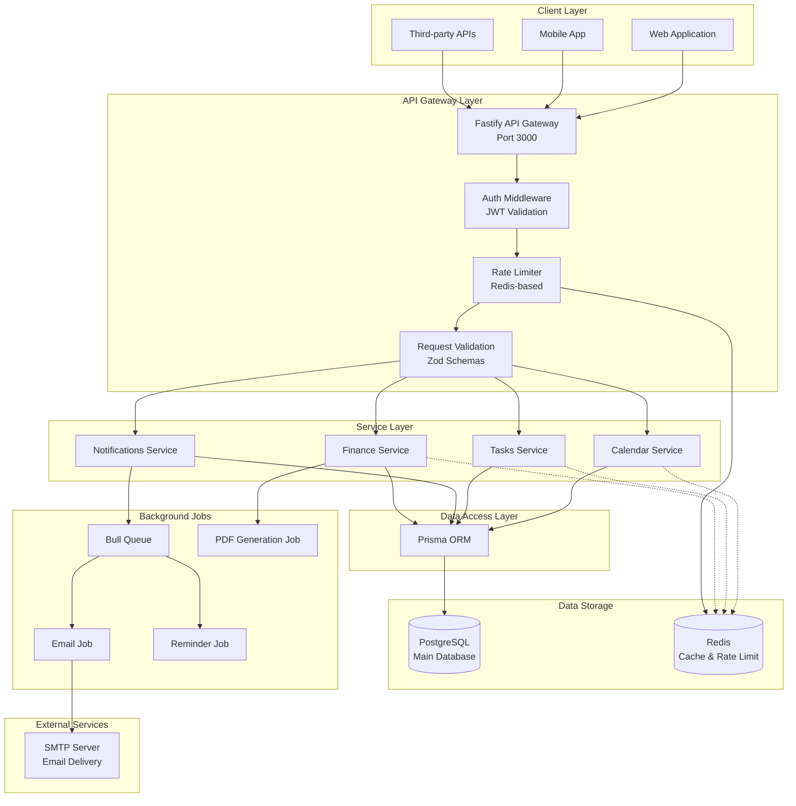

---

## API Request Flow

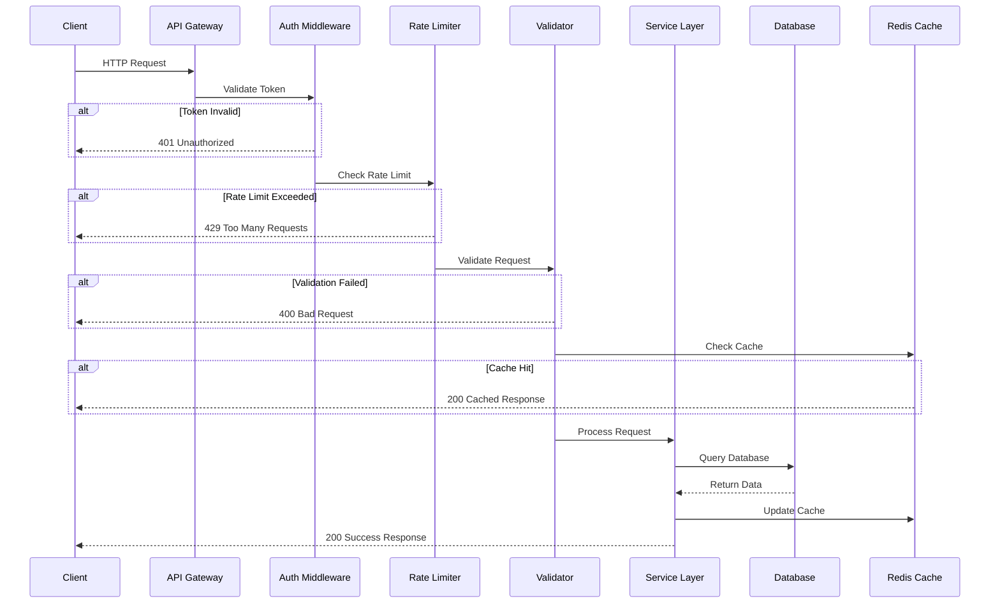

---

## Database Schema Relationships

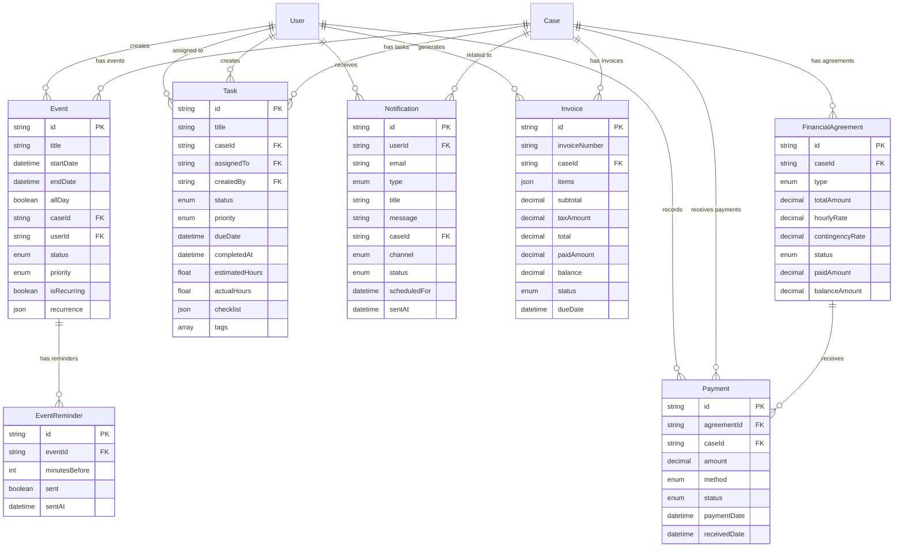

---

## Calendar Module Architecture

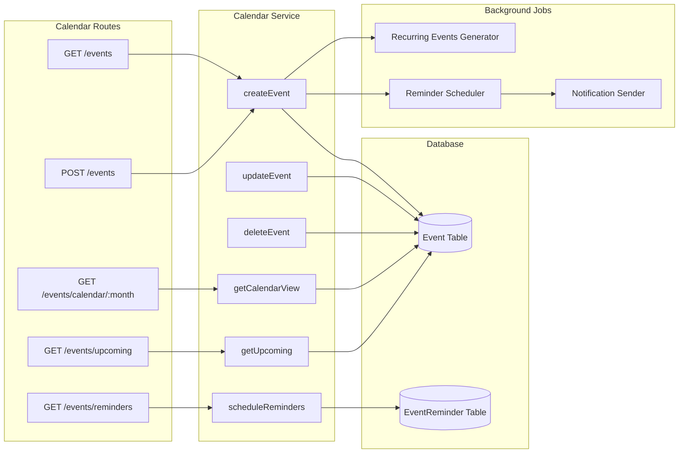

---

## Tasks Module Architecture

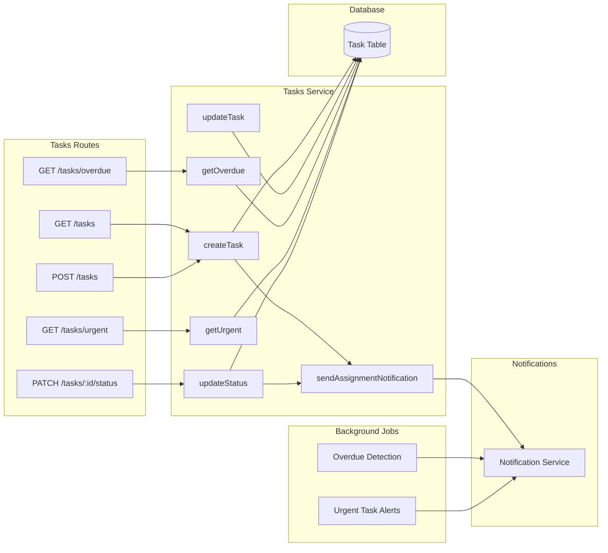

---

## Notifications Module Architecture

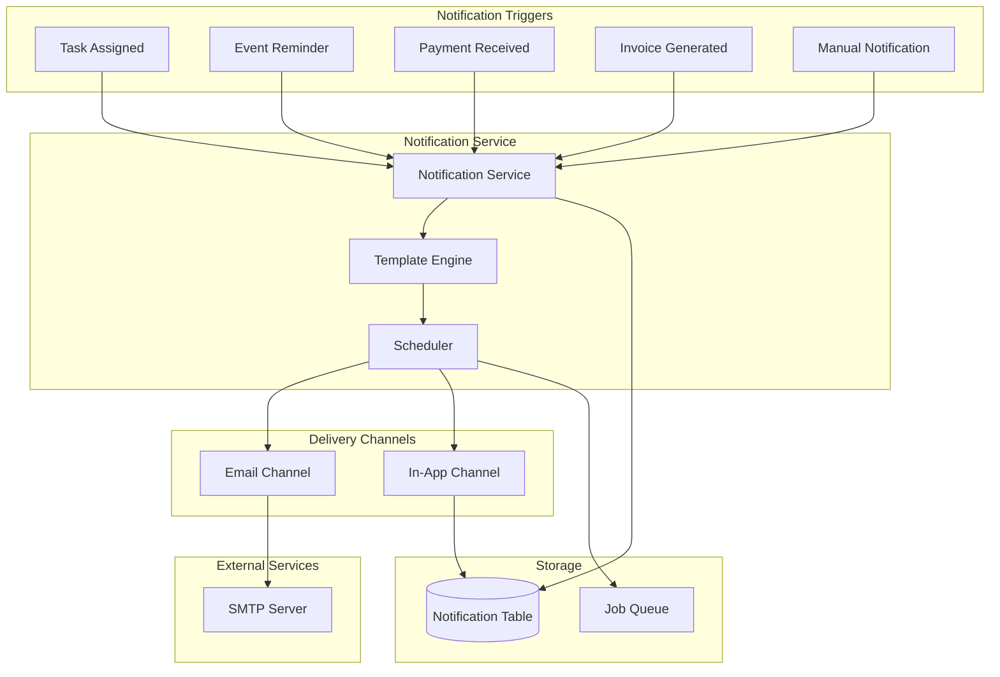

---

## Finance Module Architecture

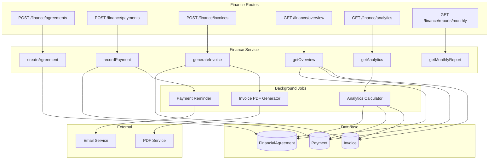

---

## Authentication Flow

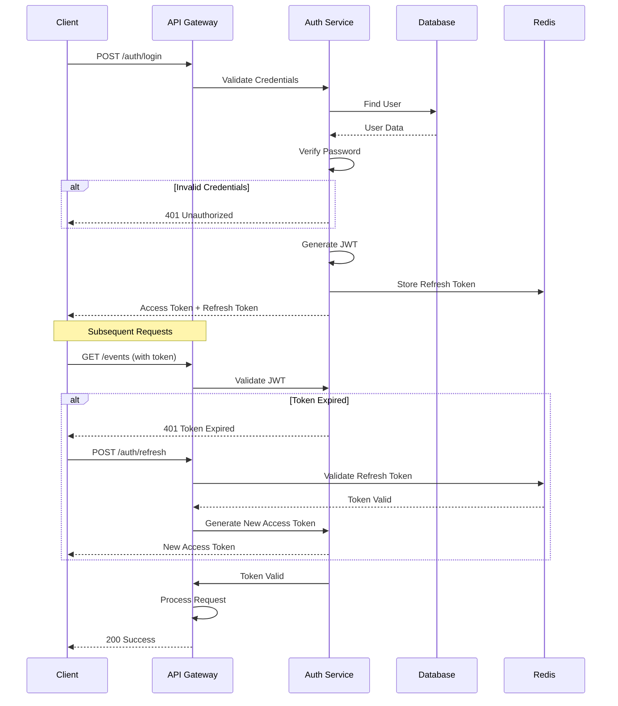

---

## Rate Limiting Flow

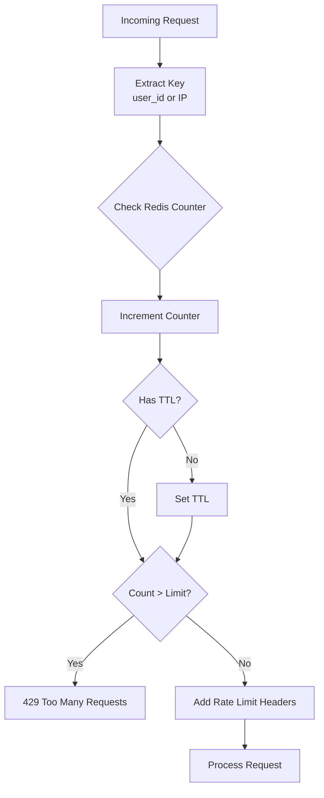

---

## Caching Strategy

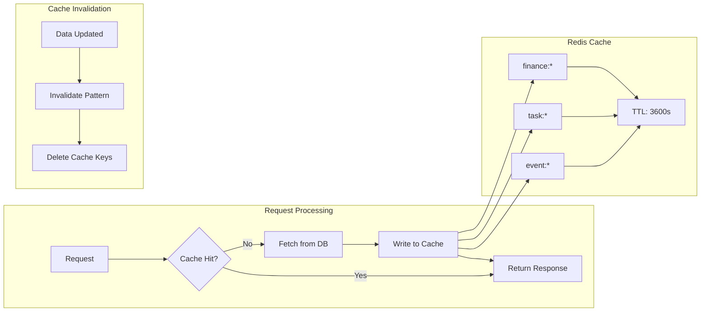

---

## Deployment Architecture

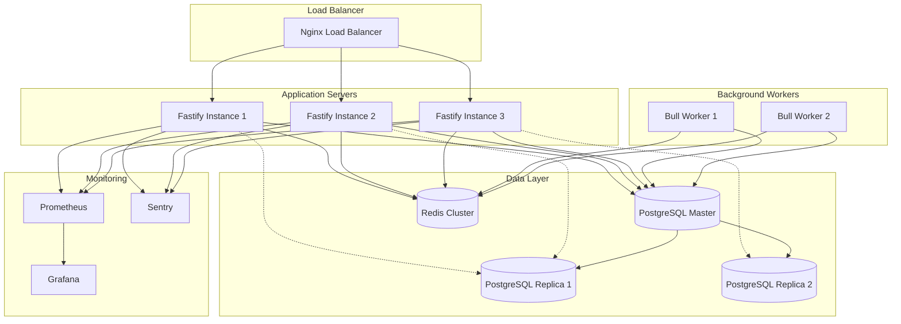

---

## Error Handling Flow

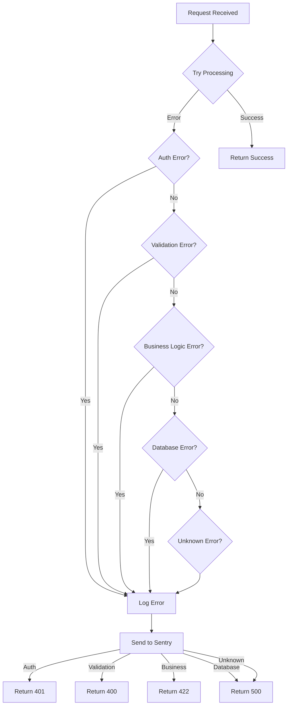

---

## Background Job Processing

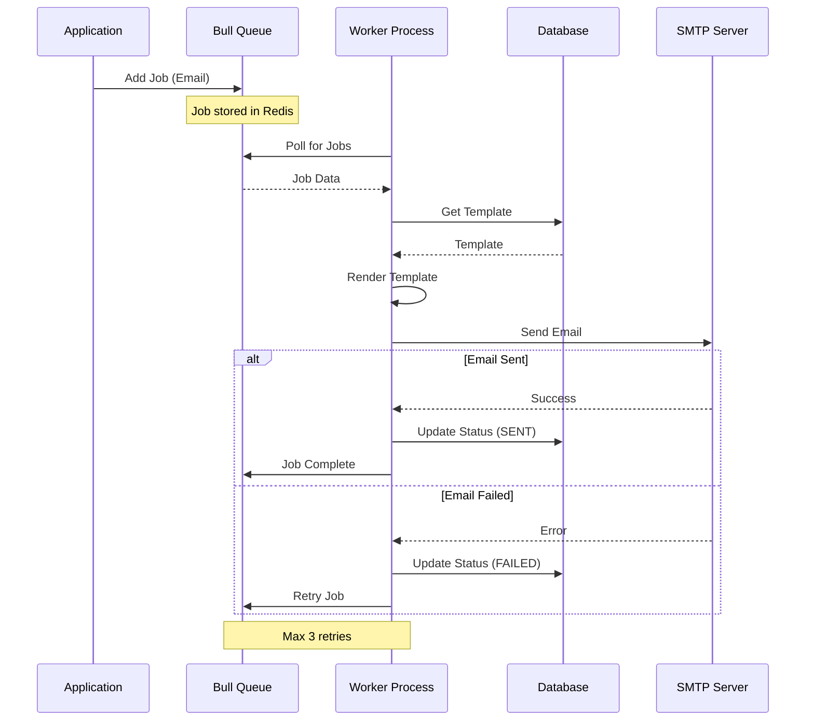

---

**End of Architecture Diagrams**
